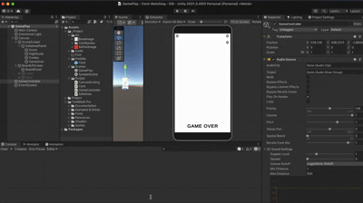

# Game Prototype

## Project Overview
This is a **game prototype** developed from scratch using **Unity 2021.3.45f1 LTS**.  
It demonstrates smooth gameplay, scoring with combo system, audio feedback, and progress persistence.  

- **Target Platforms:** iOS, Android  
- **Features:**  
  - Dynamic board layouts (rows and columns configurable)  
  - Smooth object flipping and matching animations  
  - Combo scoring system  
  - Save/load system for scores  
  - Game Over text when all objects are matched  

---

## 🎮 Gameplay Demo

  

---

## Project Structure
Assets/
Scripts/ # Game logic scripts
Prefabs/ # Prefabs for objects
Audio/ # Sound effects
Sprites/ # Visual assets
Scenes/ # Gameplay scene to play
Demo video GIF

## How to Play

1. Open the project in **Unity 2021.3.45f1 LTS**.  
2. Open the scene:  
Assets/_Project/Scenes/GamePlayScene.unity

yaml
Copy code
3. Adjust **rows** and **columns** in the **GameController** Inspector to change the board layout.  
4. Press **Play** in the Editor to test.  

---

## Switch Platform

1. Go to `File > Build Settings`.  
2. Select **iOS** or **Android**.  
3. Click **Switch Platform**.  
4. Build and run on the chosen device.  

---

## Notes
- All gameplay logic and UI elements are built from scratch.  
- Placeholder sprites and audio are included for testing.  
- Focus is on code quality and gameplay rather than visuals.  

